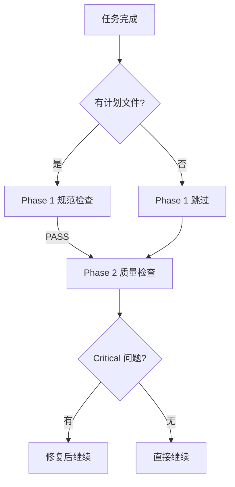

# 无计划文件降级场景示例

> **场景**: 无计划文件时降级到纯代码质量审查
> **Phase 1**: 规范合规性检查 - 跳过
> **Phase 2**: 代码质量检查 - 正常执行
> **结果**: 仅执行 Phase 2

---

## 场景描述

用户完成一个紧急 bug 修复（无详细任务计划），需要快速验证代码质量。

---

## 输入参数

```yaml
WHAT_WAS_IMPLEMENTED: 修复用户登录时的 token 泄漏问题
PLAN_OR_REQUIREMENTS: 无 (无详细任务计划)
BASE_SHA: 7c9e3d4
HEAD_SHA: 8d1f5e
```

---

## 审查结果

### Phase 1: 规范合规性检查

**状态**: ⏭️ 跳过 / Skipped

**原因**: 未找到 `detailed-tasks.yaml` 或 `OpenSpec proposal.md`

**降级行为**: 直接进入 Phase 2 代码质量检查

> **说明**: 无计划文件时，Phase 1 检查无法执行。这是设计的行为，确保紧急修复不会被阻塞。

---

### Phase 2: 代码质量检查

#### 优点 / Strengths

- **快速定位问题**: 准确识别 token 泄漏位置在 `src/middleware/jwt.ts:42`
- **安全的修复方案**: 使用环境变量存储 JWT_SECRET，修复后无密钥泄漏风险
- **保持代码简洁**: 修复未引入不必要的复杂性

#### 问题 / Issues

##### Critical (必须修复) / Critical

1. **JWT_SECRET 暴露风险**
   - 文件: `src/config/env.ts:15`
   - 问题: JWT_SECRET 直接硬编码在配置文件中，可能被提交到版本控制
   - 修复: 移除硬编码，改为从环境变量读取
   ```typescript
   // 修复前
   const JWT_SECRET = "my-secret-key-12345";

   // 修复后
   const JWT_SECRET = process.env.JWT_SECRET || throw new Error("JWT_SECRET not set");
   ```

#### 评估 / Assessment

**是否可以继续?**: ⚠️ 修复 Critical 问题后继续

**理由**: Token 泄漏是严重的安全问题，必须修复。修复后代码可以继续。

---

## 降级模式对比

| 模式 | Phase 1 | Phase 2 | 适用场景 |
|------|--------|--------|----------|
| **标准模式** | 执行规范检查 | 执行质量检查 | 有详细计划时 |
| **降级模式** | 跳过规范检查 | 仅质量检查 | 无详细计划时 |

---

## 工作流程



---

## 关键要点

### 降级触发条件

```yaml
自动降级条件:
  1. detailed-tasks.yaml 不存在
   2. OpenSpec proposal.md 不存在
  3. 用户显式跳过 Phase 1
```

### 降级影响

| 影响 | 说明 |
|------|------|
| **风险遗漏** | 无法验证是否符合计划，但质量检查仍能捕获代码问题 |
| **速度提升** | 跳过 Phase 1 节省审查时间 |
| **质量保证** | Phase 2 仍然检查代码质量、安全、测试 |

### 何时使用降级模式

```yaml
适合场景:
  - 紧急 bug 修复
  - 小型重构
  - 文档修改
  - 配置调整

不适合场景:
  - 新功能开发
  - 架构变更
  - 跨模块修改
```

---

## 最佳实践

### 有计划文件时

```
始终遵循两阶段审查:
  Phase 1 确保方向正确
  Phase 2 确保质量达标
```

### 无计划文件时

```
使用降级模式:
  1. 优先修复 Critical 问题
  2. 记录发现的问题
  3. 补充计划文档（如果需要）
```

---

**示例版本**: 1.0.0
**创建日期**: 2026-02-06
**维护**: Aria 项目组
