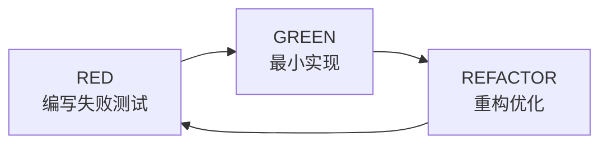
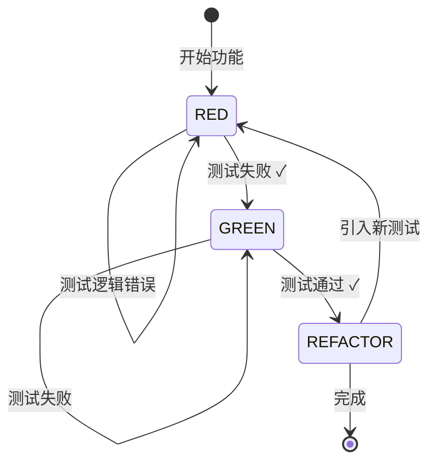

# TDD 工作流程定义

> **版本**: 1.0.0
> **来源**: TASK-002
> **Skill**: tdd-enforcer

---

## RED-GREEN-REFACTOR 循环



---

## RED 阶段

### 目标
编写一个**失败**的测试用例，明确表达需要实现的功能。

### 进入条件
- 新功能开发需求
- Bug 修复需求
- 代码重构需求

### 检查清单
- [ ] 测试文件已创建
- [ ] 测试用例已编写
- [ ] 测试运行失败（预期失败）
- [ ] 失败原因清晰明确

### 验证规则
```python
def verify_red_phase(file_path, test_file):
    # 1. 确认测试文件存在
    if not test_file.exists():
        return FAIL("测试文件不存在，请先创建测试")

    # 2. 确认业务代码不存在
    if file_path.exists():
        return WARN("业务代码已存在，考虑删除后重新开始")

    # 3. 确认测试失败
    result = run_test(test_file)
    if result.passed:
        return FAIL("测试应该失败，但通过了。检查测试逻辑")
    else:
        return PASS("RED 阶段完成")
```

### 输出
```
✅ RED 阶段完成
  测试文件: test/user_auth_test.dart
  失败原因: NoSuchMethodError: Method 'authenticate' not found
  下一步: 进入 GREEN 阶段
```

---

## GREEN 阶段

### 目标
编写**最小**的代码使测试通过，不考虑代码质量。

### 进入条件
- RED 阶段完成
- 测试用例失败且原因明确

### 检查清单
- [ ] 仅编写使测试通过的最小代码
- [ ] 不添加额外功能
- [ ] 不进行代码优化
- [ ] 测试运行通过

### 验证规则
```python
def verify_green_phase(file_path, test_file):
    # 1. 确认业务代码存在
    if not file_path.exists():
        return FAIL("业务代码不存在")

    # 2. 确认测试通过
    result = run_test(test_file)
    if not result.passed:
        return FAIL("测试未通过，请继续实现")

    # 3. 检查是否过度实现
    if has_extra_features(file_path, test_file):
        return WARN("检测到额外功能，考虑移除")

    return PASS("GREEN 阶段完成")
```

### 输出
```
✅ GREEN 阶段完成
  实现文件: lib/user_auth.dart
  测试结果: 1/1 通过
  下一步: 进入 REFACTOR 阶段
```

---

## REFACTOR 阶段

### 目标
在测试保护下改善代码结构和质量，功能保持不变。

### 进入条件
- GREEN 阶段完成
- 所有测试通过

### 检查清单
- [ ] 改善代码结构
- [ ] 提高可读性
- [ ] 消除重复代码
- [ ] 测试仍然通过
- [ ] 功能行为不变

### 验证规则
```python
def verify_refactor_phase(file_path, test_file):
    # 1. 确认测试通过
    result = run_test(test_file)
    if not result.passed:
        return FAIL("重构后测试失败，请回滚修改")

    # 2. 确认功能不变
    if behavior_changed(file_path, test_file):
        return FAIL("重构改变了功能行为，请回滚")

    # 3. 检查代码质量
    quality_score = analyze_code_quality(file_path)
    if quality_score < baseline_score:
        return WARN("代码质量下降，请检查")

    return PASS("REFACTOR 阶段完成")
```

### 输出
```
✅ REFACTOR 阶段完成
  代码质量: 提升 15%
  测试结果: 1/1 通过
  下一步: TDD 循环完成，开始下一个功能
```

---

## 阶段转换规则

```yaml
RED → GREEN:
  前置:
    - 测试文件存在
    - 测试失败
  触发:
    - 用户确认 "开始实现"

GREEN → REFACTOR:
  前置:
    - 测试通过
    - 代码为最小实现
  触发:
    - 自动提示或用户请求

REFACTOR → RED/完成:
  前置:
    - 测试通过
    - 代码质量改善
  触发:
    - 继续下一个功能 → RED
    - 或结束 TDD 循环
```

---

## 状态转换图



---

## 常见错误处理

| 错误 | 原因 | 解决方案 |
|------|------|----------|
| 测试一开始就通过 | 测试逻辑错误 | 检查测试断言，确保测试失败 |
| GREEN 后测试仍失败 | 实现不完整 | 继续编写实现代码 |
| REFACTOR 后测试失败 | 重构破坏功能 | 回滚重构，重新分析 |

---

## 与 tdd-enforcer Skill 集成

```yaml
tdd-enforcer 检查点:
  RED 阶段:
    - 检查测试文件存在
    - 验证测试失败
    - 阻止编写业务代码

  GREEN 阶段:
    - 验证测试通过
    - 检查是否为最小实现
    - 提示进入 REFACTOR

  REFACTOR 阶段:
    - 监控测试状态
    - 验证功能不变
    - 评估代码质量
```

---

## 示例

### 示例 1: 用户认证功能

```yaml
RED:
  编写测试:
    test('authenticate returns token for valid credentials', () {
      final auth = UserAuth();
      final result = auth.authenticate('user', 'pass');
      expect(result, isNotNull);
      expect(result?.token, isNotEmpty);
    });

  运行结果:
    NoSuchMethodError: Method 'authenticate' not found
  ✅ RED 完成

GREEN:
  编写实现:
    class UserAuth {
      AuthResult? authenticate(String user, String pass) {
        if (user == 'user' && pass == 'pass') {
          return AuthResult(token: 'abc123');
        }
        return null;
      }
    }

  运行结果:
    1/1 test passed
  ✅ GREEN 完成

REFACTOR:
  重构:
    - 提取验证逻辑
    - 添加密码加密
    - 改善错误处理

  运行结果:
    1/1 test passed
    Code quality: +20%
  ✅ REFACTOR 完成
```

---

**版本**: 1.0.0
**创建**: 2026-01-18
**相关**: [SKILL.md](./SKILL.md)
